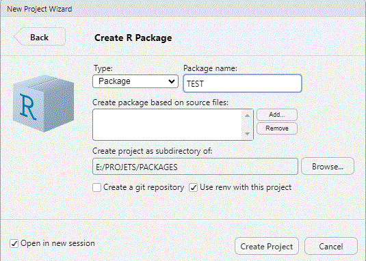

```{r, include = FALSE}
knitr::opts_chunk$set(
  collapse = TRUE,
  comment = "#>"
)

knitr::opts_chunk$set(echo = TRUE, warning = FALSE, message = FALSE)

imports <- c( 
    "devtools",
    "fs",
    "gert",
    "pathr",
    "pkgsearch",
    "rbibutils",
    "renv",
    "rstudioapi",
    "usethis",
    "utils")

suggests <- c(
    "knitr",
    "rmarkdown",
    "R.utils")

other_libraries <- c(
     "devtools",
     "pkgbuild",
     "pkgconfig",
     "pkgdown",
     "pkgload",
     "pkgmaker",
     "registry",
     "tools",
     "usethis",
     "utils"
)

librairies <- c(.packages(), imports, suggests, other_libraries)
knitr::write_bib(librairies, "packages.bib")
```

```{r setup, eval=FALSE}
library(raichepackage)
```

# Installation d'une librairie étape par étape

Les librairies disponibles publiquement sous R sont vraiment très nombreuses et répondent à bien des besoins. Toutefois, il peut arriver que certaines analyses statistiques ou des opérations de manipulation de l'environnement R ou Rstudio ne sont pas disponibles ou adéquates à nos besoins. Quelquefois ces besoins nous sont propres et ne sont même pas à partager publiquement. C'est à ce moment qu'il devient utile de développer un librairie qui pourra répondre à nos exigences.

Le développement d'une librairie sous R demeure cependant encore une expérience assez diffcile. Heureusement quelques librairies utilitaires ont été développées à cette fin

Les procédures de création d'une librairie R décrites ci-bas doivent exclusivement être réalisées dans l'environnement Rstudio. Elles utilisent les fonctionnalités de création de projet, dont celui d'une librairie, que Rsudio offrent.

\-[Création de librairies](https://building-r-packages.readthedocs.io/en/latest/index.html)

# Pour installer localement la librairie

## Création d'un projet de librairie sous Rstudio

Les réferences générales à `R` et `Rstudio` sont publiquement disponibles [@R-base].

La première étape consiste à se lancer la séquence `File`-`New Project`-`New Directory`-`R Package` (voir figure 1). A mon avis il est préférable de toujours utiliser le même répertoire pour emmagasiner nos librairies en développement: pour moi c'est `PACKAGE`.

```{r Rstudio, echo=FALSE, fig.cap="Figure 1. Écran New package project in Rstudio", out.width = '75%'}

```

Des options s'offrent aussi à vous. La plus utile à mon avis est `Open in new session`, car elle vous permet de continuer à travailler dans votre session R actuelle et de lancer une nouvelle session de R où vous pourrez fignoler votre nouvelle librairie.

L'option `Create a git repository` est principalement utile si vous travaillez dans un environnement de partage de développement de librairie.

L'option `Use renv with this project` est utile si vous désirez créer un environnement vierge comme si vous étiez sur un nouvel ordinateur. Vous devez alors réinstaller localement toutes les librairies qui vous sont nécessaires même si elles sont déjà installées sur votre plate forme. Ainsi, vous pouvez travailler sur un environnement vierge et même avec différentes versions de R. Le désaventage de cette approche est cependant que cela nécessite plus d'espace mémoire sur votre disque dur.

## Utilisation des fonctions disponibles dans la librarie raichepackage

La seconde étape consiste à installer la librairie `raichepackage` et de lancer la fonction pack_initialisation. Installer la librairie `raichepackage` permet aussi que les options déclarées dans `.onLoad()` soient effectives.

Puisque cette librairie est située sur votre poste local l'appel à install.package ne permettra pas l'installation des dépendances. C'est pourquoi il faut préalablement installer la librairie remotes et ensuite utiliser la procédure suivante.

```{r, eval=FALSE}
remotes::install_github("trinker/pathr")
package <- "raichepackage" # Ou autre librairie
# Sur un repository (CRAN ou Github)
remotes::install_deps(package, build_vignettes = TRUE)
# En local
dirpack <- dir("../")
 l1 <- grepl(package, dirpack, fixed=TRUE)
 l2 <- grepl(".tar.gz", dirpack, fixed=TRUE)
 source_pack <- dirpack[intersect(which(l1), which(l2))]
#path <- "../raichepackage_1.0.0.tar.gz" 
remotes::install_deps(source_pack, build_vignettes = TRUE)
```


Divers répertoires et fichiers seront créés et certaines informations seron insérées dans ces fichiers. Par exemple si on désire créer une librairie du nom de vraisemblance on lancera la commande suivante. En mettant en subrillance le nom de cette fonction vous pourrez obtenir l'écran d'aide associé en actionnant `F1` et l'entièreté du code source en actionnant `F2`. Vous pourrez ainsi inspecter en détail les opérations effectuées par cette fonction. L'utilisation des touches `F1` et `F2` est valide pour toutes fonctions.

```{r, eval=FALSE}
pack_initialisation("vraisemblance")
```

Plus spécifiquement les librairies nécessaires (*imports*) déclarées dans le fichier `DESCRIPTION` seront déclarées, le moteur de production de documentation Roxygen sera déclaré ainsi que sa version tout comme la lience sous laquelle sera créé la librairie . Vous devrez remplir vous mêmes les autres informations.

Un modèle de citation sera aussi ajouté dans un fichier `CITATION` que vous pourrez modifier selon vos besoins. Il en est de même d'un fichier `addins.dcf` situé dans le répertoire `inst/rstudio`.

Les fichiers `NEWS.md` et `README.Rmd` seront aussi créés. Comme leur extensions l'indiquent ceux-ci pourront être traités par Rmarkdown et leur contenu pourra ainsi être constitué de matériel Rmarkdown simple. De plus un fichier logo.png sera déposé dans le répertoire `man/figures/`. Ce dernier sera inséré utilisé automatiquement dans le fichier `README.Rmd`. Vous pouvez déposer le fichier graphique que vous désirez dans le répertoire `/divers/Readme_logo.png` et celui-ci sera recopié dans le répertoire `man/figures/` en autant que celui-ci soit renommé `logo.png`, qu'il soit au format png et qu'il ne soit pas trop volumineux. Par exemple, ici j'ai utilisé l'entête de mon département d'attache à l'Université du Québec à Montréal. Il faudra aussi renommer le nom du fichier graphique (`logo.png`) dans le fichier `README.Rmd`. Vous pourrez ensuite éditer ce fichier et, entre autres, y ajouter des options yaml telles que présentées dans l'aide de `markdown::github_document`. **NOTE: README ne semble effectif que lorsque publié sur CRAN ou Github.** Une fois la librairie installée on pourra visionner le contenu des fichiers NEWS et README à l'aides des fonctions suivantes.

```{r, eval=FALSE}
# https://blog.r-hub.io/2019/12/03/readmes/
#https://docs.github.com/en/repositories/managing-your-repositorys-settings-and-features/customizing-your-repository/about-readmes
# https://search.r-project.org/CRAN/refmans/rcompendium/html/add_readme_rmd.html
# https://building-r-packages.readthedocs.io/en/latest/vignettes-and-readme.html
# https://r-pkgs.org/other-markdown.html
# CRAN todor package
utils::news(package="malibrairie")
utils::packageDescription

```

Enfin un répertoire vignettes et un fichier modèle de vignettes nommé introduction.Rmd. seront créés. Il vous restera à apporter les modifications nécessaires à ce dernier. Il est conseillé de ne pas utiliser le menu Knit de Rstudio pour prévisualiser le résultat du traitement de ce fichier car Rstudio effectue des modifications au fichier qui rendent les opérations ultérieures de création de la librairie problématiques. Par exemple, les lignes qui suivent la ligne Vignettes ne sont plus traitables sans les remanier.

Il restera ensuite à éditer les fichiers suivants: DESCRIPTION, CITATION, NEWS.md, README.Rmd et .Rbuildignore. Enfin, il faudra créer des fonctions et des données et documenter celles-ci, ce qui sera le sujet de la section suivante.

[**Il reste à remplacer `.onLoad` dans `zzz.R` de façon à que les options soient plutôt copiées dans `.Rprofile` dans le répertoire maître de la librarie en développement. Il est encore possible de faire cela à la main en copiant la partie appropriée de la fonction `.onLoad`.**]{.underline}

# Développement de librairies

À consulter: [@wickham2023]

# Lien à des fichiers locaux

```{r, eval=TRUE, echo=TRUE}
print(file.exists("RAICHE_SCEE_2008.pps"))
dir()
```

Les liens à des fichiers locaux `file://...` ne fonctionnent pas dans le viewer (idem dans l'écran `Help`), mais seulement dans un navigateur: cela est valide aussi bien ici pour les liens dans le texte que dans la liste des références. Il faut aussi s'assurer d'avoir le lien absolu et non pas seulement relatif. La fonction `R.utils::toUrl("")` permet d'obtenir ce lien de manière sécuritaire ([inspiré indirectement par du code sur cette page web](https://stackoverflow.com/questions/62893323/a-link-to-local-html-file-in-r-vignette)).

-   [link 1](%60r%20R.utils::toUrl(%22../inst/divers/RAICHE_SCEE_2008.pps%22)%60)

-   [link 2](%60r%20R.utils::toUrl(%22logo.png%22)%60)

-   [@raiche2008; @raiche2008bis]

# Étapes préliminaires

1.  Sous Rstudio: [F]{.underline}ile - [N]{.underline}ew Project - [P]{.underline}ackage

2.  Utiliser ces fonctions nécessaires ou très utiles

3.  Par défaut celles-ci sont effectuées par `pack_initialisation()`.

4.  Pour vérifier le répertoire où est installé la librairie et cherche un répertoire spécifique effectuer:

```{r, eval=FALSE}
path <- find.package("raichepackage")
path
dir(paste(path, "/divers", sep=""))
```

```{r, eval=FALSE}
# NÉCESSAIRE OU TRÈS UTILE
devtools::load_all(".") # Charge les fonctions disponibles
devtools::document() # Transforme le code Roxygen2 en Rmd et crée les fichiers
devtools::has_devel(debug=TRUE) # Vérifie si l'environnment est OK
pkgbuild::check_build_tools(debug=TRUE) # Idem
usethis::use_description() # Crée ou modifie DESCRIPTION
usethis::use_author() # Add an author to the 'Authors@R' field in DESCRIPTION
usethis::use_citation() # Create a CITATION template
usethis::use_addin() # Add minimal RStudio Addin binding
usethis::use_gpl3_license() # Add to DESCRIPTION 
usethis::use_vignette() # Create a vignette or article (and other dir or files)
usethis::use_roxygen_md() # Use roxygen2 with markdown (add to DESCRIPTION)
```

-   Au besoin, utiliser ces fonctions:

```{r, eval=FALSE}
# OPTIONNEL
usethis::use_news_md() # Create a simple NEWS.md
usethis::use_readme_rmd() # Creates skeleton README files 
devtools::build_readme() # Devrait suivre pour mise à jour
usethis::use_data() # Create package data
usethis::use_data_raw() # Similaire
usethis::use_logo("logo.png") # Use a package logo in man/figures/logo.png (add also markdown to README)

usethis::use_pipe() # À analyser
usethis::use_rstudio() # À analyser  rarement utile
usethis::use_rstudio_preferences() # Très rarement utile
usethis::use_rmarkdown_template() # Add an RMarkdown Template
usethis::use_template() # Use a usethis-style template
```

Il peut être utile de modifier les options par défaut des librairies `usethis` et `devtools`. Par exemple pour utiliser des informations personnelles par défaut dans le développement de librairies ou pour les fichiers markdown.

```{r, eval=FALSE}
edit_r_profile("project")
edit_rstudio_snippets() # opens RStudio's snippet config for the given type
```

```{r, eval=FALSE}
# devtools::build_vignettes() Crée une vignette dans le répertoire doc/
devtools::load_all()

vignette() # Liste de toutes les vignettes pour toutes les librairies
browseVignettes() # Idem au format HTML (plus utile)
tools::getVignetteInfo("raicheutils")
devtools::build_manual() # Dans le répertoire du projet
utils::data() # Liste de tous les data des librairies
temp <- system.file(package="raichepackage") # Répertoire de la librairie
getwd()
fs::path_home() # Ex. C:/Users/raich # 
path.expand("~") # Ex. "C:/Users/raich/OneDrive/Documents"

fs::dir_tree() # Arborescence de la librairie
fs::dir_tree(temp) # Arborescence de la librairie
file_info = fs::file_info(temp)
names(file_info)
c(Path=file_info$path, permissions=file_info$permissions)
cat("\n\npath=", file_info$path, "\n\nPermissions=", as.character(file_info$permissions))
```

# INFOS {#intro}

```{theorem, label, name="Theorem name"}
Here is my theorem.
```

\@ref(thm:label)

Il n'est pas possible d'utiliser htlm_document et pdf_document dans le même fichier.

This is Chapter \@ref(intro)

-   [YAML Fieldguide](https://cran.r-project.org/web/packages/ymlthis/vignettes/yaml-fieldguide.html)
-   [Convert to an HTML vignette](https://pkgs.rstudio.com/rmarkdown/reference/html_vignette.html)

## R cmd check note

Dans la version 4.4.2 de R, pour éviter de voir apparaître le message `R cmd check note: unable to verify current time` lors de l'opération `CHECK` il faut lancer préalablement la commande suivante dans la console: `Sys.setenv('R_CHECK_SYSTEM_CLOCK' = 0)` . Je ne sais s'il est possible d'inclure cette ligne dans le lancement de CHECK, mais cela fonctionne si on lance préalablement dans la console. Il est aussi possible de rendre permanente la modification de la façon suivante et ainsi de modifier le fichier undefined.

```         
install.packages("usethis") (If not installed already)
usethis::edit_r_environ()
Add _R_CHECK_SYSTEM_CLOCK_=0 to the file
Save, close file, restart R
```

[Source de l'information](https://stackoverflow.com/questions/63613301/r-cmd-check-note-unable-to-verify-current-time)

## Date francisée dans YAML

date: '`r format(Sys.Date(), "%B %d, %Y")`' et non plus date: "`r format(Sys.Date(), "%B %d, %Y")`"

[Source de l'information] (<https://stackoverflow.com/questions/23449319/yaml-current-date-in-rmarkdown#>:\~:text=This%20is%20a%20little%20bit%20tricky%2C%20but%20you,so%20Pandoc%20can%20use%20the%20value%20from%20Sys.time%28%29.)

## Problèmes avec les exemples

J'ai du utiliser le code qui suit, car je ne réussis pas à faire compiler la librairie avec des exemples et je dois annuler leur exécution.

\examples{
\dontrun{
hello()
}
}

## Lecture des lignes du log (mais ferme le fichier après)

readLines('C:/Users/raich/AppData/Local/Temp/Rtmpc7xJfq/file25a022cf46e1/raichepackage.Rcheck/00check.log')

# Création d'une librairie à partir d'unfichier Markdown

[litr 1](https://yihui.org/en/2023/01/litr-package/) [litr 2](https://github.com/jacobbien/litr-project)

```{r, eval=FALSE}
remotes::install_github("jacobbien/litr-project@*release", subdir = "litr")
litr::render("create-litr/index.Rmd")
```

[fusen](https://thinkr-open.github.io/fusen/) [rpl](https://github.com/yihui/rlp) [Litterate programming et MLE](https://yihui.org/rlp/)

<https://yihui.org/rlp/>

# Désinstaller une librairie

```{r, eval=FALSE}
remove.packages("meteoR")
```

# Addins, snippets, connexions and shortcuts

# Divers utilitaires

```{r, eval=FALSE}
dir("./vignettes/") # Un répertoire plus bas
dir("../") # Un répertoire plus haut
R.utils::ProgressBar()
R.utils::readRdHelp("options", format="text")
R.utils::setOption()
R.utils::toUrl(getwd()) # Donne l'url d'un fichier ou d'un répertoire
```

# Documentation Roxygen2

* [Roxygen2](https://roxygen2.r-lib.org/)

* [Programmation dans Roxygen2](https://mpn.metworx.com/packages/roxygen2/7.1.0/articles/rd.html)

# ANCIEN CODE

```{r, eval=FALSE}
dir("../") # Mon répertoire de packages
remotes::install_local("../raichepackage_1.0.0.tar.gz")
library("raichepackage")

```

# Sites personnels de Zotero, Github et Rstudio cloud

[Github](%22https://gitlab.com/graiche1%22): 'raiche.gilles\@uqam.ca' zjsvz9n8

[Rstudio cloud](%22https://login.posit.cloud/login?redirect=%2Foauth%2Fauthorize%3Fredirect_uri%3Dhttps%253A%252F%252Fposit.cloud%252Flogin%26client_id%3Dposit-cloud%26response_type%3Dcode%26show_auth%3D0&product=cloud%22): 'raiche.gilles\@uqam.ca' Zjsvz9n8\$

[Zotero](%22https://www.zotero.org/user/login/%22): 'raiche.gilles\@uqam.ca' zjsvz9n8

# Références
